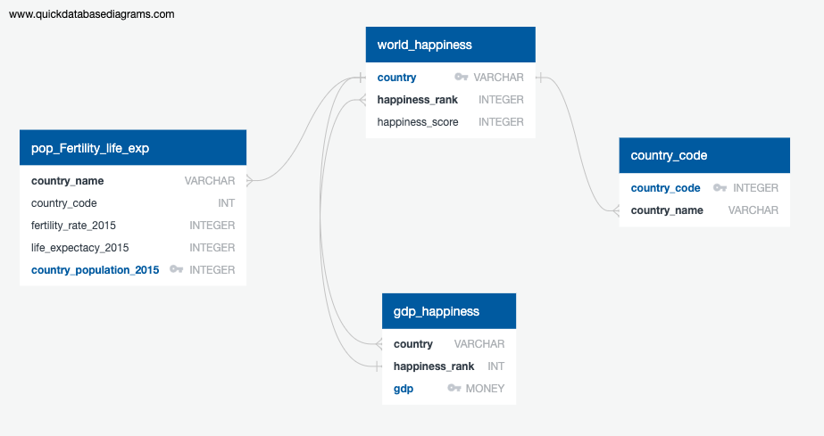

# ETL-Project: Team 2
Roamn Koshel, Zi Jin, Eric Farrell, and Lisa Rios

# World Happiness ETL: Project Report:

*Goal: Perform ETL World Happiness dataset from Gallup World Poll, pull in additional datasets to include accurate population, fertility rate, life expectancy and GDP from the World Bank.

## Extract: original data sources and formatting

### Datasets and Sources (All in CSV format from Kaggle): 

*World Happiness Report: World Happiness Report 
Source: [Gallup World Poll (Pull from: 2015 & 2016)](https://www.kaggle.com/unsdsn/world-happiness?select=2015.csv) 

*Population, Fertility Rate, and Life Expectancy: 
Source: [World Bank Data](https://www.kaggle.com/gemartin/world-bank-data-1960-to-2016) 
                         
*GDP: Source: [GDP per capita: International Monetary Fund](https://www.kaggle.com/pamhohhgkgm/gdp-per-capita-and-life-satisfaction2017)
 
## Quick Database Diagrams:
Before cleaning the datasets we used QBD to visualize our goals for each dataset:
 

## Transform: data cleaning or transformation

### Cleaning World_Happiness Dataset:
* CSV was already in a fairly cleaned status

* Removed unused columns: Region, Standard Error, Economy, Family, Health, Freedom, Trust, Generosity, Dystopia Residual.

* Left with Country, happiness rank and happiness score

* Renamed DF columns to all lower-case and removed spaces.

### Cleaning Population, fertility, and life expectancy datasets:
* The data set contains year from 1960 - 2016, only kept country name, country code and 2015 columns.

* Took out indicator name and indicator code columns of each data set

* combined country name, country code, population, fertility and life expentancy in one data frame.

### Cleaning GDP Dataset:
* Removed unnecessary columns, such as units in USD, from the gdp_per_capita.csv. 

* The two remaining columns were country and GDP. Brought in the World Happiness Data csv and used the country and happiness rank columns only. 

* We combined the two resulting data frames into one based on the country and removed any countries that were not included either in both datasets or did not have their GDP listed. 

* Finally, we sorted the countries by GDP and added another ranked column so that the countries original happiness rank and GDP rank could be more easily compared.

## Load: the final database, tables/collections, and why this was chosen.
Type of Final Production Database: SQL

* Four tables were created on Postgres before we performed the load from jupyter notebook: world_happiness, pop_fertility_life_exp, gdp, and country code

* The type of final production database to load the data into: relational: We chose to use a relational database because our data points were all referring to a specific country.  We needed to show that each column was referring to the countries gdp, life expectancy, fertility, and population.

* The final tables or collections that will be used in the production database

* We were able to successfully match our initial DBD goal (see DBD image above)

* Completed a sample query in jupyter notebook to show a successfull load

## Challenges:

* Total number of countries from the world happiness dataset was less than and other datasets

* We wanted to use more years but only went with 2015 due to other datasets

* Countries with symbols in their name

* GDP money datatype conversion

* The usual github merging jupyter notebook challenges
